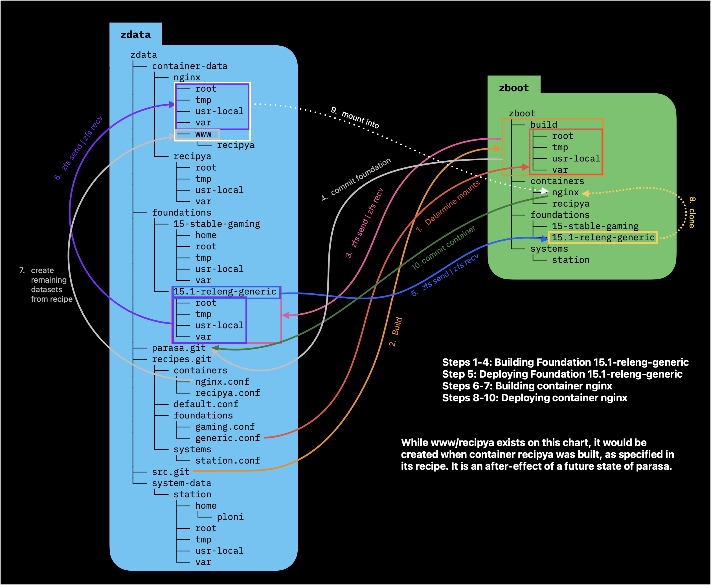

# Overview

parasa is a system for observable system changes. Its goal is to make all changes to a system repeatable without overhead bloat or user fatigue. A common story goes like this: The sysadmin downloads a package, and it doesn't work out of the box. To get it working, she fiddles around with config levers and files in either /etc/ ~/.config/ /usr/local/.config/ et cetera. Eventually that program starts running and she goes on with her day. In three months, she has no memory of what she did to make the app work, and it would be an entire process to figure it out again. Hopefully she never has to. Another story: A sysadmin wants to locally host some recipes on her home server. She tries several solutions, and finally settles on one. Unfortunately, she forgot to snapshot her system before starting out on this task and now after deleting the bad packages, she may still have random databases, config files, and general kruft haunting her machine forever.

With perfect hygiene, and without being so concerned about a few megabytes in the age of terabytes, these are non-problems. Unfortunately I can't handle the idea of kruft.

Parasa sets out to solve these problems and a few more (including better support for CoW principles with jails).

## Part 1: Foundations, Containers, Systems

Parasa has three major components. Foundations are build-from-source images of the FreeBSD base system. From them we make snapshots and clones in zfs. These CoW clones underpin the other two components, containers and systems. A container and a system are almost identical creatures. They're both composed of recipes, datasets, mounts, and diffs. The only difference is that containers are running jails handled by FreeBSD's jail utility, and systems are the actual build that runs on the hardware. (Nothing's stopping a user from running a system as a container, however. they're identical concepts).

### Foundations

A foundation is a build of FreeBSD. The user should be able to set all the normal variables or kernel configs one could set in a normal FreeBSD from-source build. We store all these choices in a "recipe". These recipes can be shared with other users, since they're just a bundle of config files. A recipe may not define a certain knob or config option, and thus the end user of that recipe will have to pick it themselves. For example, a gaming recipe may set some kernel options in a config file, but leave the actual source branch of FreeBSD's git unpinned, allowing the user to pick from releng/15.1, stable/15, etc... Once a foundation recipe has been selected and the user hits "build", a new Foundation artifact is created. This is named {numeric-version}-{branch-type}-{recipe-name}, eg 15.1-releng-gaming. This allows the built artifacts to be sorted by FreeBSD version, then release schedule type, and then by recipe name. Once a foundation is built, it's snapshotted at the patch level of the freebsd source branch it was built off of.

### Containers and Systems

Containers and Systems are built on top of Foundations, which serve as the CoW base for a system or container. For example, if the user wants to run that 15-stable-gaming" as their computers boot config, they would create a system from this foundation. this is as simple as cloning the foundation and following the system recipe (which is identical to a container recipe), which might do something like install default packages, create users, etc. Systems and containers also have a mechanism to embed fstab options in their recipes. Then, this system is mounted at / next boot (via zfs set -u) and when the user reboots, the computer now runs that system, which is based on that foundation. *In this sense, systems are just the user's changes on top of the base system, but not a part of the base system. This makes them easy to update*. Containers are identical, except they get mounted at /containers/ and managed by the jail utility.

### Recipes

Recipes are the magic that make any of this feasible. For foundations they define all build options, and for containers and systems they define first-start orchestration, as touched on earlier, to do things like install default packages or add users or config files. We will flesh out how they're put together and how they work later, when we have more of a concrete idea of how these parts slot together.

## Part 2: Hierarchy

Parasa is best conceptualized using a 2-pool model. 1) Boot pool (zboot) and 2) Data pool (zdata). The boot pool is where the running system and all containers live. Since zfs can only create CoW clones intra-pool, all of our actual running objects must live here. The datapool hoards all other data, like mount points and data-lakes imported and used by containers or systems.

A foundation is a pristine build of FreeBSD with config levers pulled. Each foundation name stands for a unique collection of levers. All of these foundation objects are zfs datasets (eg we built the final system into a mounted dataset). Any built foundation lives on the data pool, in zboot/foundations/{foundation-name}. For example:
```
zdata/foundations/
    15.1-releng-gaming
    15-stable-gaming
    15.1-releng-generic
```

Any foundation that's currently in use as a CoW target must also be completely replicated on the boot pool:

```
zboot/foundations/
    15.1-releng-generic
```

When the user builds a container or system from one of their foundations, it's shallowly cloned with `zfs clone` from that foundation on the boot pool (if it does not exist on the boot pool, it will have to `zfs send | zfs recv` onto the boot pool first. eg:

```
zboot/foundations/
    15.1-releng-generic
    15-stable-gaming
zboot/containers
    nginx               (clone of zboot/foundations/15.1-releng-generic@{patch-level})
zboot/systems
    gaming              (lone of zboot/foundations/15-stable-gaming@{patch-level})
```

This keeps duplication of base systems to a minimum, which is awesome.

When a new patch-level comes out for a foundation recipe we've built, it must be updated. The first step is to clone the foundation to a working DESTDIR area. Then, we synch the freebsd source repo to the appropriate branch and build with the recipe's kernconf and associated knobs into that DESTDIR. we snapshot the new patch-level, and this can be incrementally sent with zfs to the authoritative data pool first, and then also to the boot pool.

## Part 3: Recipes

So far we've talked about how beautiful the inheritance tree looks if you just hand-wave the rest of the problems, including how you actually rebase a system or container onto an updated foundation snapshot using zfs, which doesn't have three-way merge (since a file could be different between base and the user's edits, as well as between the base and the update). In fact, zfs doesn't even have fast-forward functionality. Half of the answer lies in recipes, and the other half in git, and the third half in unaccountable foreign mounts. (all problems worth solving have at least three halves).

All files can be vaguely split out into:

A) Text and configuration files (eg: /etc/rc.conf)
B) Binary files with text file sources from which they can be derived (eg /etc/pwd.db is built from /etc/master.passwd)
C) Binary files which just exist (eg ~/.ssh/id_rsa)

Additionally, all actions to get a system or container from point A (a freshly cloned foundation) to point B (a running service or current state system) are essentially:

1) download some packages
2) run some shell commands
3) (containers only) define your jail.conf (see `jail(8)`) file

To satisfy the correlation between the file types above and the actions you can take in a machine just stated, to get a machine from point A to point B is the entire trick. Doing this in an interactive and ergonomic fashion is the holy grail of machine management. With empirical testing, we've discovered that recipes require the following files:

Foundation, system, and container recipes are all a structured configuration file, like yaml, toml, or json. We should NOT create a white-space important file format. we SHOULD parse this with a hand-written program (or if there's an existing file format that's really good, we can use that. Probably compiled, possibly lua. This file declares:

- the minimum version that the recipe works for, eg 15.0, 15, 14.3, etc. 
- pkgs to install
- commands to run on the newly created foundation, system, or container, after installing packages
- default mounts and their mountpoints (fstab format)
- association table between source files and derived binary files, and the command to compile them (file type B)
- For foundations it also declares the kernconf to use, or allows you to write a kernconf inline, eg `kernconf {}`. wherein a valid kernconf file can be written.

These config files are cascading, so a higher level config file is added to the lower level config file, with the closer version overriding the parent version where they conflict. This is useful for things like default mount sets that apply to all foundations and default derivation associations that apply to all foundations. An example:

The collection of recipes exists as an upstream git. A user's parasa system uses the git dir for local recipes too, and if the user wants to create an upstream PR for a recipe they like, like nginx, they may.

A few examples of conf files follow:

```
# example recipes.git file structure
# upstream is github.com/elliejs/parasa-recipes
zdata/recipes.git/
    default.conf
    foundations/
        gaming.conf
        generic.conf
    containers/
        recipya.conf
        nginx.conf
```

```
# default.conf
derivations = (
    etc/master.passwd	etc/pwd.db			pwd_mkdb -p -d /etc /etc/master.passwd
    etc/master.passwd	etc/spwd.db			pwd_mkdb -p -d /etc /etc/master.passwd
    etc/login.conf		etc/login.conf.db	cap_mkdb /etc/login.conf
    etc/mail/aliases	etc/mail/aliases.db	newaliases
)

datasets = [
    root
    tmp
    var
    usr/local
]
```
```
# generic.conf
kernconf = GENERIC
```
```
# gaming.conf
import default.conf

kernconf = {
    include         GENERIC

    # Unique string identifier for this custom kernel
    ident           LEETGAMING

    device drm
    options SCHED_ULE
}

pkg = [
    linux-steam-utils
]

datasets += [
    home
]

commands += {
    sysrc linux_enable="YES"
}
```
```
# nginx.conf
import default.conf

pkg = [
    nginx
]

datasets += [
    www ro
]
```
```
# recipya.conf
import default.conf

requires += [
    nginx
]

pkg = [ git go npm ]

datasets += [
    <nginx>/www/recipya
]
```

All the recipe files are the same format, with the exception that foundations and only foundations can define `kernconf` or `buildopts` and containers and only containers can define `requires`. As of right now, the grammar looks like:

`import`: expand imported file inline at that place
`()`: line delimited list
`[]`: whitespace delimited list
`{}`: text literal, to be parsed by some other program. usually /bin/sh
`<>`: variable replacement, but the scope is context dependent.
`#`: comment. This is pre-process stripped everywhere except `{}`.
`=`: overwriting set to.
`+=`: append to previous definition. Array shapes must agree: eg `()` cannot `+=` to `[]`

**keywords**:
- `requires`: List of containers that must exist and be set up before this container. (recursive auto-setup is absolutely encouraged and allowed). Usually this is because the container relys on some shared storage or infrastructure set up by the required recipe's container. In the example, nginx means containers/nginx, not the pkg.
- `pkg`: List of packages to install in the jail, eg `pkg -j`
- `datasets`: List of container or system root relative paths which should be broken out into separated, non-tracked datasets. we store these at zdata/system-data/{name}/{dataset} and zdata/container-data/{name}/{dataset} respectively. If <{container-name}> is specified as the first directory in the mount, we use its root path, eg zdata/container-data/{<this-name>}/{dataset}. If a dataset in the list is `ro`, `rw`, `rq`, `sw`, or `xx`, that is the fs_type of the preceding dataset. It's possible a line-delimited list is a better datatype for this, with a whitespace separated couplet, but I think this is parseable enough.
- `kernconf`: Text literal of a kernconf (see `config(5)`)
- `buildopts`: Text literal of make definitions or the ENVIRONMENT flags in (`build(7)`)
- `derivations`: Line separated list of triplets. The first value is the source text file, the second value is the end result binary file, and the third (or remaining, since a command can have many spaces) value is the command used to regenerate the binary from the source.
- `ver`: only allow this recipe to run for branches of this pinned version. Allowed assignments are `=`, `>`, `>=`, `<`, `<=` (eg `ver>=15`, or `ver=15.1`)
- `commands`: Text literal shell file of commands to run after pkgs are installed.
- `jailconf`: Text literal additional text to append to the jail config for a container. Only useful for container recipes.

Since we know the expected datatypes (List, Line-List, Text-literal, Variable) of each key, we can statically check the correctness at parse-time and warn the user. Of course, this also means we don't need these different types, but it's worth having them as they increase readability.

It's also possible that there's an off the shelf file format that does all we want it to while still looking pretty. If so, we can investigate using that.

kernconf and buildopts are only applicable to foundation builds, and ignored otherwise. jailconf is only applicable to container builds, and ignored otherwise.

## Part 4: Pool Layout

Now that we know the logic behind the moving parts, we need to nail down where this all belongs on disk. zdata, which can be best thought of as a slower, very large pool, owns all the upstream caches for artifacts, and all foregin mount points, and zboot, which is a smaller, much faster, pool, owns all running entities. An example pool layout follows:

```
zboot
├── build
│   ├── root
│   ├── tmp
│   ├── usr-local
│   └── var
├── containers
│   ├── nginx
│   └── recipya
├── foundations
│   ├── 15-stable-gaming
│   └── 15.1-releng-generic
└── systems
    └── station
zdata
├── container-data
│   ├── nginx
│   │   ├── root
│   │   ├── tmp
│   │   ├── usr-local
│   │   ├── var
│   │   └── www
│   │       └── recipya
│   └── recipya
│       ├── root
│       ├── tmp
│       ├── usr-local
│       └── var
├── foundations
│   ├── 15-stable-gaming
│   │   ├── home
│   │   ├── root
│   │   ├── tmp
│   │   ├── usr-local
│   │   └── var
│   └── 15.1-releng-generic
│       ├── root
│       ├── tmp
│       ├── usr-local
│       └── var
├── parasa.git
├── recipes.git
│   ├── containers
│   │   ├── nginx.conf
│   │   └── recipya.conf
│   ├── default.conf
│   ├── foundations
│   │   ├── gaming.conf
│   │   └── generic.conf
│   └── systems
│       └── station.conf
├── src.git
└── system-data
    └── station
        ├── home
        │   └── ploni
        ├── root
        ├── tmp
        ├── usr-local
        └── var
```

While not all of these datasets are explained yet, the remaining will be explained shortly.

## Part 5: Orchestration

Now that we've named the key players and laid out the groundwork for the disk layout and specification file layout, we must talk about how these interact with each other. The data pool, zdata is the authoritative home for artifacts and data. As such, all built artifacts from recipes reside in zdata. All mountable datasets as defined by `datasets` exist in this pool too. An orchestration example: 

At last, the final datasets are put to use and can be explained. As you recall, all files are roughly binnable into one of thee types:

1) Text files
2) Binary files created by text files
3) Binary files with no text source

A sysadmin could write everything that's required for a container to run in the recipe.conf for that container, and should, if pushing to upstream, but this is infeasable for the messy life we more commonly live. For systems, this is outright improbable. We need another method of tracking down the changes we've made to a system or container since the last time we've saved and reconciled our work. To do this, we leverage git. When a foundation is freshly built, the following actions are taken:

1) synch src.git to the proper branch, and fetch the new head of that branch
2) create a clean build space on zboot, and create datasets for all mountpoints requested in the recipe
3) build the requested kernconf and buildopts
4) install the pkgs requested by the recipe
5) play the commands requested by the recipe
6) rerun the derivations list compiled by the recipe
7) build an mtree in etc/mtree.dist
8) git add all files in the build dir (even in mounted datasets)
9) add all mounted datasets to gitignore
10) Commit this build to parasa.git on zdata under the orphan branch "foundations/{foundation-name}" (eg foundations/15-stable-gaming).

As of writing, the git add before gitignore should only affect a few files written in /var/ and /root/. After a clean build and upload to zdata/foundations and then a commit, we have the ability to use this foundation as a basis for our secondary types, systems and containers. A container recipe picks out a foundation to rest on, and its recipe is then played out.

1) If the foundation requested from the options on zdata does not exist on zboot, zfs send | zfs recv it into zboot/foundations/{foundation-name}. Do not send or recv any of the child datasets, since we'll be mounting them from zdata later.
2) clone zboot/foundations/{foundation-name} into zboot/containers/{container-name}
3) zfs send | zfs recv the child datasets of zdata/foundations/{foundation-name] into zdata/container-data/{container-name}/. We do a full zfs send | zfs recv instead of a clone because these datasets divorce themselves from the tracking responsibilities of their parent foundations, as they're mostly unaccountable binary datastores.
4) create any further datasets requested by the container recipe in zdata/container-data/{container-name} (or, if using a <var> request to create a dataset in a different container's realm, relying on requiring the other container's existence, do that now).
5) write a jail fstab that mounts all owned datasets as zfs, using the `ro`, `rw`, etc properties laid out in the recipe. Any borrowed dataset (eg using a <var> template) are mounted with nullfs, since they're mounted with zfs in the owning other container
6) write a jail config with the jailconf of the requested container
7) service onestart the jail (this mounts the mountpoints)
8) pkg -j install the pkgs requested by the container recipe
9) jexec the commands requested by the container recipe
10) rerun the derivations list compiled by the container recipe
11) rebuild the mtree, ignoring
12) 
 

## Part 6: Human Computer Interaction

### User Story 1: Building a New Foundation

The user is presented with a TUI interactive menu: `New`, `Update`, `Save`, ``. They select `New` and are presented with a new menu with the title **New:**. The menu options are: `Foundation`, `Container`, and `System`. If the user has built no foundations, then both containers and systems are greyed out and non-inteactive. The user selects Foundation. The user is presented with a new menu window, with the Title **New: Foundation**, and the fields to fill out: `Recipe` and `Branch`. The options the tool can present for `Recipe` are found in the cloned parasa-recipe dir, under foundations/. The user selects the recipe from an interactive list, and then the branch. The branches available are the branches in the FreeBSD source repo (https://github.com/freebsd/freebsd-src). The user then hits the GO! button in the TUI, and the wheels begin to turn. We close the TUI and begin printing out information. First, we check that the branch is accepted by the ver stated in the recipe. We then, since it's a foundation, pull out the kernconf into a file, emplaced in {freebsd-src-repo}/sys/<architecture>/conf/

**Foundation**
- Recipe: **generic.conf**
- Branch: **releng/15.1**


